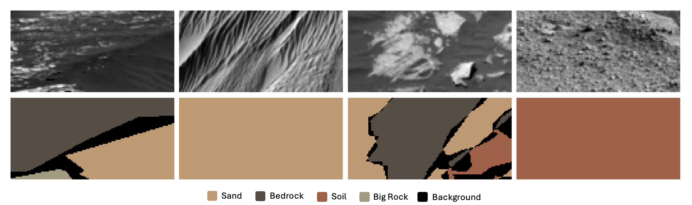

# Artificial Neural Networks and Deep Learning 2024

---

## Homework 2: Mars Terrain Semantic Segmentation with Deep Learning

### Team Members
- Maria Aurora Bertasini*
- Marco Cioci*
- Francesco Rosnati*
- Luca Tramacere*

*Master's candidate in High Performance Computing Engineering at Politecnico di Milano


## About
This project focuses on semantic segmentation of 64x128 grayscale Mars terrain images, assigning each pixel to one of five terrain classes. Paired masks provide pixel-wise labels. The goal is to build a model for accurate classification, evaluated by mean intersection over union (mIoU) excluding the background class (label 0).
This template serves as a comprehensive tool for testing and running various models. To use it, create a `model.py` file and import it in the model section.

The most notable models we tested are stored in the `models` folder, while the best version is executed in [`FinalModel.ipynb`](./FinalModel.ipynb).


## Name your model
```python
# Model name
model_name = 'template'
```

```python
from datetime import datetime

# Generate timestamp
timestamp = datetime.now().strftime("%y%m%d_%H%M%S")

# Unified filename for both the final model and checkpoint
model_filename = f"model_{model_name}_{timestamp}.keras"
```

## Connect Colab to Google Drive
```python
COLAB = True

if COLAB:
    print("COLAB")
    from google.colab import drive

    drive.mount("/gdrive")
    %cd /gdrive/My Drive
else:
    print("NO COLAB")
```


## Import Libraries
```python
# General imports
import os
import random
from datetime import datetime

# Numerical and data manipulation
import numpy as np
import pandas as pd

# TensorFlow and Keras
import tensorflow as tf
from tensorflow import keras as tfk
from tensorflow.keras import layers as tfkl
from tensorflow.keras.callbacks import EarlyStopping, ModelCheckpoint

# Mixed precision setup
from tensorflow.keras import mixed_precision
mixed_precision.set_global_policy('mixed_float16')

# GPU configuration
physical_devices = tf.config.list_physical_devices('GPU')
for device in physical_devices:
    tf.config.experimental.set_memory_growth(device, True)

# Sklearn for train-test splitting
from sklearn.model_selection import train_test_split

# OpenCV for image processing
import cv2

# tqdm for progress visualization
from tqdm import tqdm

# Matplotlib for visualization
import matplotlib.pyplot as plt
from matplotlib import cm
from matplotlib import colors
%matplotlib inline

# Set seeds for reproducibility
np.random.seed(42)
tf.random.set_seed(42)

# Print environment details
print()
print(f"TensorFlow version: {tf.__version__}")
print(f"Keras version: {tfk.__version__}")
print(f"GPU devices: {len(tf.config.list_physical_devices('GPU'))}")
```


## Load Data
A cleaning process was applied to the training data to address the presence of outliers. Specifically, images with objectively incorrect masks were identified and removed, while for images with uncertain mask quality, most were retained to preserve diversity and encourage generalization.

The final dataset used for training was saved as `clean_dataset.npz`.

```python
# --------------- #
# Load the dataset
# --------------- #

data_name = 'clean_dataset.npz'
file_path = f"data/{data_name}"
data = np.load(file_path)


training_set = data["training_set"]
X_train = np.stack(training_set[:, 0], axis=0)  # Images
y_train = np.stack(training_set[:, 1], axis=0)  # Masks

X_test = data["test_set"]  # Test Images

# Preprocess images and masks
if X_train.ndim == 3:
    X_train = X_train[..., np.newaxis]
if X_test.ndim == 3:
    X_test = X_test[..., np.newaxis]

X_train = X_train / 255.0
X_test = X_test / 255.0

if y_train.ndim == 3:
    y_train = y_train[..., np.newaxis]

original_count = X_train.shape[0]
print(f"Number of images the {data_name} dataset: {original_count}")

# Define label mapping
label_mapping = {
    0: 'Background',
    1: 'Soil',
    2: 'Bedrock',
    3: 'Sand',
    4: 'Big Rock'
}

category_map = {key: key for key in label_mapping.keys()}
```

```python
# Split data into training and validation sets
X_train_final, X_val, y_train_final, y_val = train_test_split(
    X_train, y_train, test_size=0.2, random_state=42
)

# Print shapes of the datasets
print("Shape of X_train_final:", X_train_final.shape)
print("Shape of X_val:", X_val.shape)
print("Shape of y_train_final:", y_train_final.shape)
print("Shape of y_val:", y_val.shape)
```

## Augmentations
All the augmentation techniques we experimented with are detailed in the [`Augmentations.ipynb`](./Augmentations.ipynb) notebook.  

In this template, we propose the augmentation strategy that was ultimately selected. To use it, import all the necessary functions from [`AugmentationsUtils.py`](./AugmentationsUtils.py). 

The `apply_augmentations` function applies the selected augmentations to the training set while retaining the original images. Additionally, it plots example outputs to visualize the effects of the augmentations.


```python
from AugmentationsUtils import *

# Augment the training set and plot images for the specified index
augmented_X_train, augmented_y_train = apply_augmentations(
    X_train_final,
    y_train_final,
    num_augmented= 3,  # Number of augmented versions per original image
    plot_index= 0  # Index of the image to plot
)
```


##  Model
Please import your model from the `models` folder. This folder contains some of our best models, including the final model (nome.py). 

The final model ([`final_dual_branch.py`](./models/final_dual_branch.py)) is also imported and executed in the [`FinalModel.ipynb`](./FinalModel.ipynb) notebook.

```python
from models.you_name_model import *

# Instantiate the model
input_shape = augmented_X_train.shape[1:]  # Use the shape of the input images
num_classes = 5  # As per dataset details
model = get_model(input_shape=input_shape, num_classes=num_classes, dropout_rate=0, l2_reg=1e-4)
```

### Custom functions and metrics definition

```python
# -------------------------------------- #
#                  Metric                #
# -------------------------------------- #

class MeanIntersectionOverUnion(tf.keras.metrics.MeanIoU):
    def __init__(self, num_classes, labels_to_exclude=None, name="mean_iou", dtype=None):
        super(MeanIntersectionOverUnion, self).__init__(num_classes=num_classes, name=name, dtype=dtype)
        if labels_to_exclude is None:
            labels_to_exclude = [0]  # Default to excluding label 0
        self.labels_to_exclude = labels_to_exclude

    def update_state(self, y_true, y_pred, sample_weight=None):
        # Convert predictions to class labels
        y_pred = tf.math.argmax(y_pred, axis=-1)

        # Flatten the tensors
        y_true = tf.reshape(y_true, [-1])
        y_pred = tf.reshape(y_pred, [-1])

        # Apply mask to exclude specified labels
        mask = tf.reduce_all([tf.not_equal(y_true, label) for label in self.labels_to_exclude], axis=0)
        y_true = tf.boolean_mask(y_true, mask)
        y_pred = tf.boolean_mask(y_pred, mask)

        # Update the state
        return super().update_state(y_true, y_pred, sample_weight)
    

# -------------------------------------- #
#              Loss Functions            #
# -------------------------------------- #


def mean_iou_loss(num_classes, labels_to_exclude=None, epsilon=1e-6):
    """
    Mean IoU Loss Function.

    Args:
        num_classes: Number of classes in the segmentation task.
        labels_to_exclude: List of labels to exclude when calculating IoU.
    Returns:
        A function that calculates the Mean IoU loss.
    """
    def loss(y_true, y_pred):
        # Convert predictions to class probabilities
        y_pred = tf.nn.softmax(y_pred, axis=-1)

        # Convert true labels to one-hot encoding
        y_true_one_hot = tf.one_hot(tf.cast(tf.squeeze(y_true, axis=-1), tf.int32), num_classes)

        # Flatten the tensors
        y_true_flat = tf.reshape(y_true_one_hot, [-1, num_classes])
        y_pred_flat = tf.reshape(y_pred, [-1, num_classes])

        # Compute intersection and union
        intersection = tf.reduce_sum(y_true_flat * y_pred_flat, axis=0)
        union = tf.reduce_sum(y_true_flat + y_pred_flat, axis=0) - intersection

        # Mask out excluded labels
        if labels_to_exclude is not None:
            for label in labels_to_exclude:
                intersection = tf.tensor_scatter_nd_update(
                    intersection,
                    [[label]],
                    [0.0]
                )
                union = tf.tensor_scatter_nd_update(
                    union,
                    [[label]],
                    [0.0]
                )

        # Compute IoU for each class and average over classes
        iou = (intersection + epsilon) / (union + epsilon)
        mean_iou = tf.reduce_mean(iou)

        # Invert to use as loss (lower IoU means higher loss)
        return 1.0 - mean_iou

    return loss


def focal_loss_ignore_class_0(alpha=0.25, gamma=2.0, num_classes=None):
    """
    Focal Loss Function that ignores class 0, with fixed alpha for all other classes.

    Args:
        alpha: Weighting factor for positive classes to address class imbalance.
        gamma: Focusing parameter to down-weight easy examples.
        num_classes: Number of classes in the segmentation task.
    Returns:
        A function that calculates the Focal Loss, ignoring class 0.
    """
    def loss(y_true, y_pred):
        # Convert predictions to class probabilities (softmax output)
        y_pred = tf.nn.softmax(y_pred, axis=-1)

        # Convert true labels to one-hot encoding
        y_true_one_hot = tf.one_hot(tf.cast(tf.squeeze(y_true, axis=-1), tf.int32), num_classes)

        # Ignore class 0 in the loss calculation
        y_true_no_bg = y_true_one_hot[..., 1:]  # Remove the first class (class 0)
        y_pred_no_bg = y_pred[..., 1:]         # Remove the first class (class 0)

        # Compute the focal loss
        cross_entropy = -y_true_no_bg * tf.math.log(y_pred_no_bg + 1e-8)  # Cross entropy with stability

        # Apply a fixed alpha for all classes and calculate the focal loss
        weight = alpha * tf.math.pow(1 - y_pred_no_bg, gamma)  # Focusing weight
        focal_loss = weight * cross_entropy

        # Average over all pixels and classes (across the batch and spatial dimensions)
        return tf.reduce_mean(tf.reduce_sum(focal_loss, axis=-1))

    return loss

# -------------------------------------- #
#                   Tools                #
# -------------------------------------- #

def apply_category_mapping(label):
    """
    Apply category mapping to labels.
    """
    keys_tensor = tf.constant(list(category_map.keys()), dtype=tf.int32)
    vals_tensor = tf.constant(list(category_map.values()), dtype=tf.int32)

    # Create the lookup table
    table = tf.lookup.StaticHashTable(
        tf.lookup.KeyValueTensorInitializer(keys_tensor, vals_tensor),
        default_value=0
    )

    # Ensure the label is a Tensor
    label = tf.convert_to_tensor(label, dtype=tf.int32)

    return table.lookup(label)


def create_segmentation_colormap(num_classes):
    """
    Create a linear colormap using a predefined palette.
    Uses 'viridis' as default because it is perceptually uniform
    and works well for colorblindness.
    """
    return plt.cm.viridis(np.linspace(0, 1, num_classes))


def apply_colormap(label, colormap=None):
    """
    Apply the colormap to a label.
    """
    # Ensure label is 2D
    label = np.squeeze(label)

    if colormap is None:
        num_classes = len(np.unique(label))
        colormap = create_segmentation_colormap(num_classes)

    # Apply the colormap
    colored = colormap[label.astype(int)]

    return colored

class VizCallback(tf.keras.callbacks.Callback):
    def __init__(self, images, labels, frequency=5):
        """
        Initialize the visualization callback.

        Args:
            images: A batch of validation images (numpy array or tensor).
            labels: Corresponding ground truth labels (numpy array or tensor).
            frequency: Frequency (in epochs) to display visualizations.
        """
        super().__init__()
        self.images = images
        self.labels = labels
        self.frequency = frequency

    def on_epoch_end(self, epoch, logs=None):
        if epoch % self.frequency == 0:  # Visualize only every "frequency" epochs
            batch_size = len(self.images)
            predictions = self.model.predict(self.images, verbose=0)
            y_preds = tf.math.argmax(predictions, axis=-1).numpy()

            # Define label mapping and custom colors
            label_mapping = {
                0: 'Background',
                1: 'Soil',
                2: 'Bedrock',
                3: 'Sand',
                4: 'Big Rock'
            }
            colors = [
                '#000000',  # 0: Background 
                '#A95F44',  # 1: Soil 
                '#584C44',  # 2: Bedrock 
                '#C5986F',  # 3: Sand 
                '#A69980'   # 4: Big Rock 
            ]
            cmap = ListedColormap(colors)

            # Create legend patches
            patches = [mpatches.Patch(color=colors[i], label=label_mapping[i]) for i in label_mapping]

            for i in range(batch_size):
                image = self.images[i]
                label = self.labels[i]
                label = apply_category_mapping(label)
                y_pred = y_preds[i]

                plt.figure(figsize=(18, 6))

                # Input image
                plt.subplot(1, 3, 1)
                plt.title(f'Input Image (Sample {i})')
                if image.shape[-1] == 1:
                    plt.imshow(image.squeeze(), cmap='gray')
                else:
                    plt.imshow(image)
                plt.axis('off')

                # Ground truth mask
                plt.subplot(1, 3, 2)
                plt.title('Ground Truth Mask')
                plt.imshow(label.numpy().squeeze(), cmap=cmap, vmin=0, vmax=len(label_mapping) - 1)
                plt.axis('off')

                # Predicted mask
                plt.subplot(1, 3, 3)
                plt.title('Predicted Mask')
                plt.imshow(y_pred.squeeze(), cmap=cmap, vmin=0, vmax=len(label_mapping) - 1)
                plt.axis('off')

                # Add legend
                plt.legend(handles=patches, bbox_to_anchor=(1.05, 1), loc='upper left', borderaxespad=0.)

                plt.tight_layout()
                plt.show()

```


### Training settings
Please substiutite your parameters

```python
# OPTIMIZER
optimizer = tf.keras.optimizers.AdamW(
    learning_rate=1e-3,   # Starting learning rate
    weight_decay=1e-4     # Regularization strength
)

# METRIC
metric_main = 'sparse_categorical_accuracy'

# LOSS FUNCTION
loss_fn = focal_loss_ignore_class_0(alpha=0.25, gamma=2.0)

# Compile the model
model.compile(
    optimizer=optimizer,
    loss=loss_fn,
    metrics=[metric_main, MeanIntersectionOverUnion(num_classes=5, labels_to_exclude=[0])]
)
```

```python
# Early stopping and learning rate scheduler
early_stopping = tf.keras.callbacks.EarlyStopping(
    monitor='val_mean_iou',   # Metric to monitor
    patience=10,                # Number of epochs with no improvement after which training will be stopped
    restore_best_weights=True   # Restore the best model found
)

lr_scheduler = tf.keras.callbacks.ReduceLROnPlateau(
    monitor='val_mean_iou',    # Metric to monitor
    factor=0.5,            # Factor by which the learning rate will be reduced
    patience=5,            # Number of epochs with no improvement after which learning rate will be reduced
    verbose=1,             # Verbosity mode
    min_lr=1e-6            # Lower bound on the learning rate
)

# Add ModelCheckpoint callback to save the best model based on validation loss
model_checkpoint = tf.keras.callbacks.ModelCheckpoint(
    filepath=model_filename,  # Use the unified filename
    monitor='val_mean_iou',  # Monitor validation metrics
    save_best_only=True,  # Save only the best model
    mode='max',  # Mode to maximize the monitored quantity
    verbose=1
)
```

```python
batch_size = 16
epochs = 1000
seed = 42

viz_callback = VizCallback(X_val[:2], y_val[:2])  # Visualize first 2 validation images

# Choose which callbacks to activate
callbacks = [early_stopping, lr_scheduler, viz_callback, model_checkpoint]

history = model.fit(
    augmented_X_train, augmented_y_train,
    batch_size=batch_size,
    epochs=epochs,
    validation_data=(X_val, y_val),
    callbacks=callbacks,
    verbose=1
)

# Retrieve best epoch and corresponding metrics from EarlyStopping based on Mean IoU
best_epoch = history.history['val_mean_iou'].index(max(history.history['val_mean_iou']))  # Index of the best validation mIoU
best_val_miou = max(history.history['val_mean_iou'])  # Best validation mIoU
best_val_loss = history.history['val_loss'][best_epoch]  # Best validation loss at that epoch

# Print the best metrics
print(f"Training completed after {best_epoch + 1} epochs (Early Stopping).")
print(f"Best Validation Mean IoU: {best_val_miou:.4f}")
print(f"Corresponding Validation Loss: {best_val_loss:.4f}")

# Save the final model after training
model.save(model_filename)
print(f"Model saved to {model_filename}")
```


## Predictions

```python
# Load the most recent model
model = tfk.models.load_model(model_filename, compile = False)
print(f"Model loaded from {model_filename}")

model.compile(
    optimizer=optimizer,
    loss=loss_fn,
    metrics=[metric_main, MeanIntersectionOverUnion(num_classes=5, labels_to_exclude=[0])]
)

# Predictions
preds = model.predict(X_test)
preds = np.argmax(preds, axis=-1)
print(f"Predictions shape: {preds.shape}")

# Convert predictions to DataFrame
def y_to_df(y):
    n_samples = len(y)
    y_flat = y.reshape(n_samples, -1)
    df = pd.DataFrame(y_flat)
    df["id"] = np.arange(n_samples)
    cols = ["id"] + [col for col in df.columns if col != "id"]
    return df[cols]

# Save predictions to CSV
submission_filename = f"sub_{model_name}_{timestamp}.csv"
submission_df = y_to_df(preds)
submission_df.to_csv(submission_filename, index=False)

# Download submission
if COLAB:
    from google.colab import files
    files.download(submission_filename)


print(f"Submission saved to {submission_filename}")
```


### Visualize Predictions

```python
# Function to visualize predictions for a list of indices with a legend
def visualize_predictions(idx_list):
    # Ensure idx_list is a list even if a single integer is provided
    if isinstance(idx_list, int):
        idx_list = [idx_list]

    # Create legend patches
    patches = [mpatches.Patch(color=colors[i], label=label_mapping[i]) for i in label_mapping]

    for idx in idx_list:
        img = X_val[idx]
        true_mask = y_val[idx]
        pred_mask = model.predict(img[np.newaxis, ...])[0]
        pred_mask = np.argmax(pred_mask, axis=-1)

        plt.figure(figsize=(18, 6))

        # Input Image
        plt.subplot(1, 3, 1)
        plt.title(f'Input Image (Index: {idx})')
        if img.shape[-1] == 1:
            plt.imshow(img.squeeze(), cmap='gray')
        else:
            plt.imshow(img)
        plt.axis('off')

        # True Mask
        plt.subplot(1, 3, 2)
        plt.title('True Mask')
        plt.imshow(true_mask.squeeze(), cmap=cmap, vmin=0, vmax=len(label_mapping)-1)
        plt.axis('off')

        # Predicted Mask
        plt.subplot(1, 3, 3)
        plt.title('Predicted Mask')
        plt.imshow(pred_mask.squeeze(), cmap=cmap, vmin=0, vmax=len(label_mapping)-1)
        plt.axis('off')

        # Add Legend
        plt.legend(handles=patches, bbox_to_anchor=(1.05, 1), loc='upper left', borderaxespad=0.)

        plt.tight_layout()
        plt.show()

# Example usage with a list of indices
visualize_predictions([i for i in range(27, 37)])  # Adjust the range as needed
```
